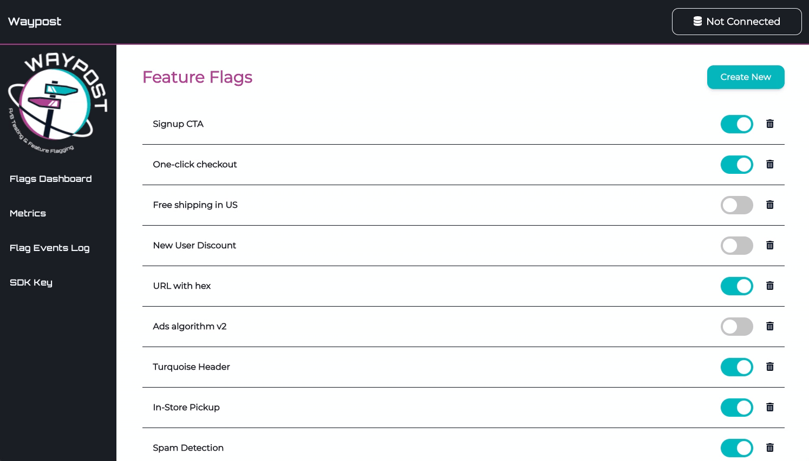

# Data Source

If you would like to run experiments using Waypost, you will need to allow us access to your PostgreSQL* database in which your user event data is stored. Waypost’s statistics service will aggregate and analyze this data, running statistical tests on it to deliver you meaningful results.

**Waypost currently only supports PostgreSQL, although we plan to support other types of databases in the future.*

### Logging Events

To ensure maximum flexibility, users of Waypost manage their own logging of events. This means if you already have logging set up for user events you want to measure, then there is very little you need to do. See below for an explanation of the information needed to analyze your logged data.

For experiments, you will need to create a table that keeps track of which users were assigned into which treatment for the experiments they were exposed to, and at what time. When you create an experiment via the Waypost-UI, the experiment’s ID is displayed on the page. Use this ID for the `experiment_id` when logging when users are exposed to the experiment.

### Data Requirements

In order for Waypost to analyze your data, the data must be available in a standardized format. You are free to organize your tables however you wish, as long as you can write a SQL query that formats it into the structure Waypost requires. Queries needed from you are for:

1. Users assigned into experiments - what time and which treatment. This only needs to be filled out once, when connecting Waypost to the data source, your Events DB. This query should return a table containing the following columns:
    - `experiment_id` INTEGER
    - `user_id` VARCHAR or INTEGER
    - `timestamp` TIMESTAMP
    - `treatment` BOOLEAN
2. Events for metrics you want to measure, such as impressions, clicks, conversions, time on site, etc. One query is needed per distinct metric you choose to add (configurable on the *Metrics* page on the Waypost UI). The query for metrics should return a table containing one row per event. Required columns in the query are:
    - `user_id` VARCHAR or INTEGER
    - `timestamp` TIMESTAMP
    - `value` INTEGER or FLOAT (only necessary for non-binomial type metrics)

### Set Up Connection

Once you have queries that can return data in the requested format, you can connect Waypost to your Events DB.

1. Create a username and password for Waypost to access your database.
2. Go to the Waypost-UI and the button on the top-right corner which should say “Not Connected” if you haven’t established a connection to the Events DB. Fill out the form with the new account info for Waypost, with the query Waypost’s back-end can use to retrieve user assignments in experiments.
3. Upon submission,  the credentials will be tested to verify the connection and query return the required fields. You will receive an alert if any field is not correct.

