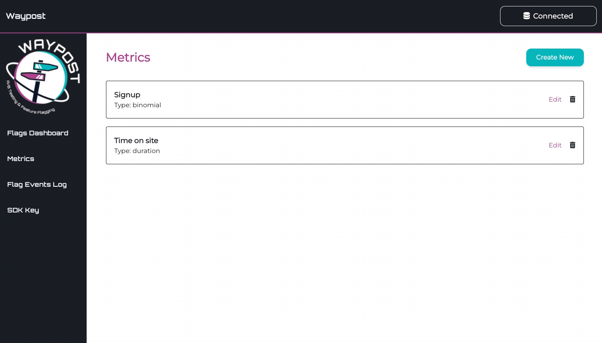

# Experiment Metrics

When you create an experiment, you will be asked what metrics you want to measure to evaluate the success of the experiment. You will need to select at least one during creation, but you can edit which metrics you’re applying at a later time if necessary. In order to have metrics to select from, you will need to first set up your metric definitions in the *Metrics* page on the Waypost-UI. There are four different types of metrics:

- **Binomial** - a discrete metric, measures actions that a user can take or not take, and is typically reported as a rate (proportion) of how many out of a total eligible group had an action. For example, conversion rate measures how many people who were eligible to signup did so, and click-through rate (CTR) measures how many people who saw something (e.g. an ad) decided to click on it.
- **Revenue** - a continuous metric, measures a dollar (or other currency) amount generated per unit. For example, a marketplace app may have a metric that measures the daily sales revenue per seller.
- **Duration** - a continuous metric, measures an amount of time. Common examples include time spent on site and time for a page to load.
- **Count** - a continuous metric, measures a count of a specific event. This means each unit in the experiment (e.g. user or session) will have a value associated for the event. Examples of this include number of items purchased, number of pages visited, number of ad clicks, etc.

You will also be asked to provide a query for each metric — please see the [Experiment Data Source](data_source) page for more information on this.

