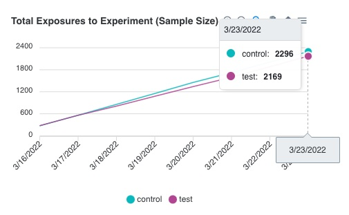
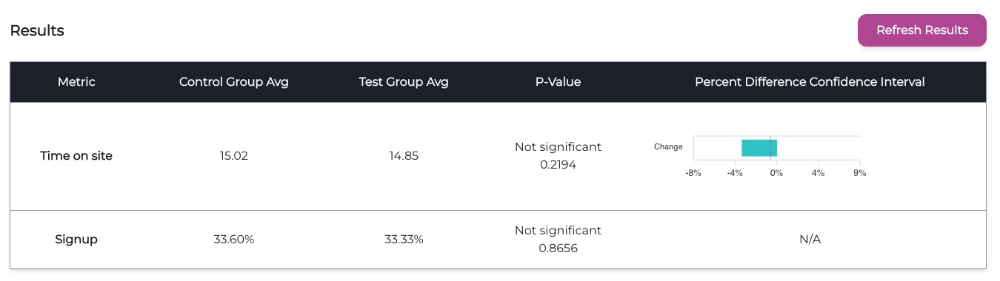

# Understanding the Results

There are two main pieces of information you can view on the experiment: 1) the exposures over time, and 2) the statistics for each metric.

**Exposures**

The “Exposures” line chart displays how many total users have been added to the experiment in each treatment group as of each day, since the beginning of the experiment. Use this chart to keep track of the sample size and determine when you are ready to end the experiment.

This data gets updated once every night through a CRON job on Waypost’s back-end that queries your Events DB and aggregates the exposure data into a daily count. You can read more about connecting your database in the “*Experiment Data Source*” section of the documentation.

**Statistical Results**

When you are ready to end the experiment, click the “Refresh Results” button on the experiment’s page. This will run the analysis on Waypost’s backend and will populate the table with the updated statistics. In the table, you will see a row for each metric that you have attached to the experiment.  Below is an explanation of the information each metric will have:

- **Control Group Avg** - this is the average (for continuous metrics) or proportion (for binomial metrics) for the **control** group.
- **Test Group Avg** - this is the average (for continuous metrics) or proportion (for binomial metrics) for the **test** group.
- **P-Value** - this is a statistics concept that describes the probability that the result occurred by random chance. Typically one concludes that the difference is statistically significant *only* if the p-value is strictly less than 0.05. Waypost uses 0.05 as the cutoff, so you will see it say “Significant” or “Not significant” based on the p-value. For more information on p-values, see [this article](https://www.investopedia.com/terms/p/p-value.asp).
- **Percent Difference Confidence Interval** (only available for continuous metrics) - this chart displays the 95% confidence interval of the difference observed between the test and control group. This means that there is a 95% probability that the true difference relies somewhere between the start and the end of the interval. Another way to interpret the statistical significance is by looking at this chart: if the bar overlaps with 0, then it is not significant because it is likely that there was no difference. Whereas if the bar resides completely above or below 0, then one can be fairly confident that there was a change. For more information on confidence intervals, see [this article](https://www.investopedia.com/terms/c/confidenceinterval.asp).

For those who are curious to know, on the back-end Waypost uses a t-test for continuous metrics and a Chi-squared test for discrete/binomial metrics.