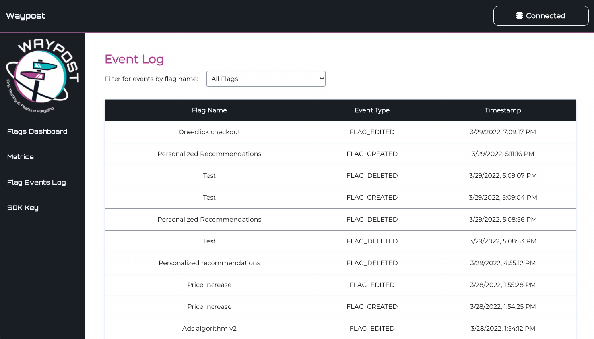

# Flag Events Log

The Flag Events Log page, accessible via the left sidebar, displays a table of actions performed on feature flags, ordered by most recent to least recent. This is useful if you would like to see the history of a feature flag. Event types include “FLAG_CREATED”, “FLAG_DELETED”, “FLAG_TOGGLED”, and “FLAG_EDITED”. You can filter for events for a specific flag by selecting the name of your desired flag in the drop-down.

