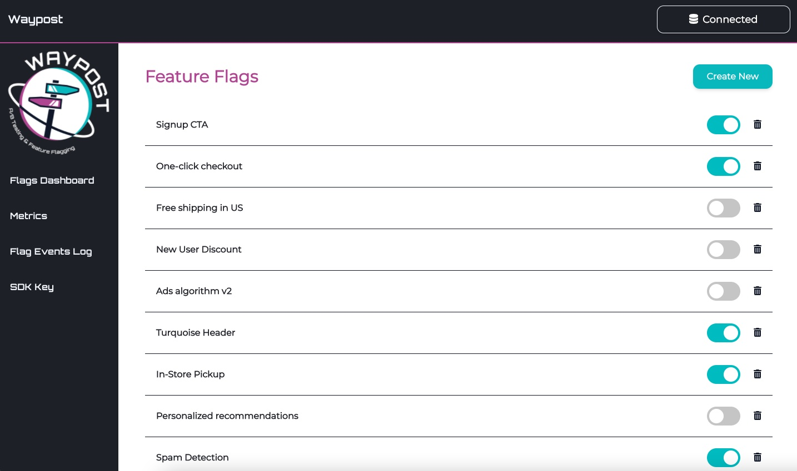

Waypost contains several core features to help you manage your feature flags, view changes made to flags, and set up and run experiments.

# Managing Feature Flags
On the Flags Dashboard (the home page), you will see a list of all your feature flags and their status (on or off) denoted by a turquoise toggle.

### Creating a Feature Flag

From the Flags Dashboard, you can create a new feature flag by clicking on the “Create New” button on the top right. A modal will pop up asking you to fill in some fields. Make sure the name is unique, since that will be used as the identifier in the SDK. The “Active?” checkbox refers to whether you want the feature initially turned on or off.

“Percent of Users Exposed” refers to what percent of users you want the feature to be “on” for, which is useful if you are using the flag as a *rollout* or as an experiment. For this to work, you must attach a user ID to each user of your application that will be hashed to determine whether they receive the flag in the “on” state or the “off” state. If you’re running A/B tests, you must also send this user ID to the Events DB in order to be able to run analysis on the data. If you already have a user identification system in place, you can use that; if not, you’ll have to create one to use Waypost.

### Feature Flag Details

You can view the details and experiments for a specific feature flag by clicking on the name of the feature flag from the Flags Dashboard page. This will take you to the flag’s page, where you can edit the flag (name, description, percentage, and custom assignments), as well as manage experiments for that feature. For more information on creating and managing experiments, please see the “Experimentation Guide” section of the docs.

### Custom User Assignments

When editing a flag, Waypost-UI allows you to specify any specific users you want bucketed into a treatment. This is especially useful for cases when a developer wants to test the feature on their end, but doesn’t want anyone else to see it. To achieve that, the developer can simply set the rollout percentage to 0%, and put their user ID in the custom assignments as “Always On”, so that they can ensure that they can test the feature on their device.

You can view custom assignments by clicking “Show custom assignments” from a flag’s details page. Custom assignments can be changed at any time by clicking on the “Edit Flag” button and deleting or adding a custom assignment. Note: A user ID cannot have more than one custom assignment per flag.