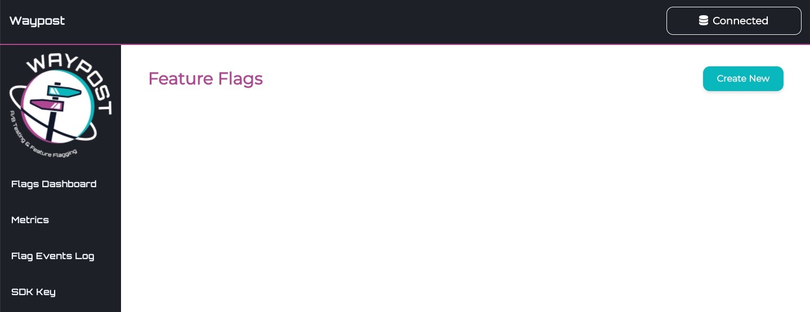

# Quickstart
The fastest way to get up and running with Waypost is with Docker, by running the `docker-compose.yml` file we have provided. Doing so will boot up a Waypost client, server, PostgreSQL database, and the flag provider. Clients using the SDK will connect to the flag provider running on localhost:5050 and can view the Waypost user interface on localhost:3000.

1. Clone the `waypost-docker` Github repository ([https://github.com/waypost-io/waypost-docker](https://github.com/waypost-io/waypost-docker))

```
git clone https://github.com/waypost-io/waypost-docker.git
cd waypost-docker
```

2. Run `docker-compose up --build`

3. Visit `http://localhost:3000` to view the Waypost UI and start adding feature flags!


